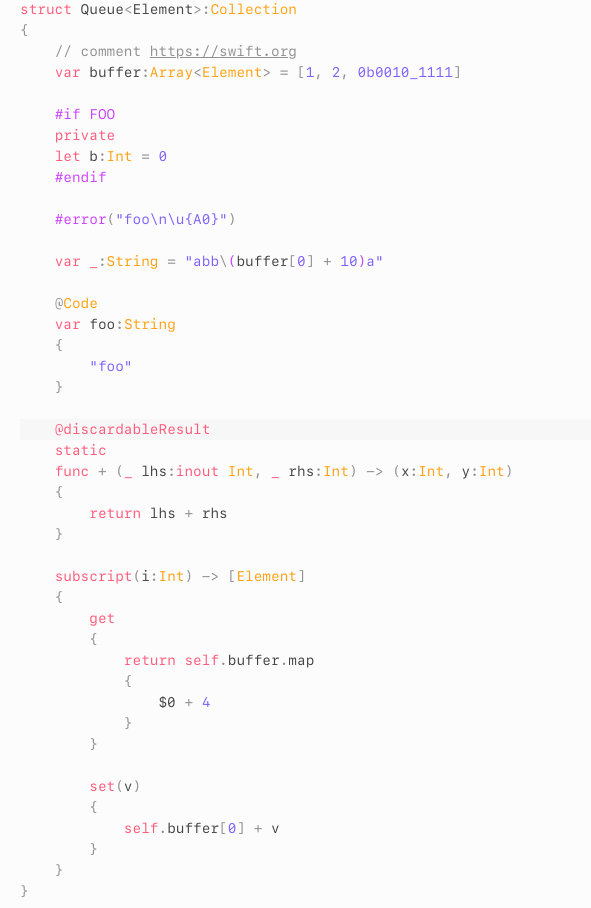

> GitHub has announced they are [deprecating](https://github.blog/2022-06-08-sunsetting-atom/) the Atom text editor. Accordingly, we will also be deprecating `atomic-blonde`. 

*Atomic-blonde* is a *SourceKit*-based syntax highlighter for the swift language. Unlike highlighters powered by regular expression grammars, *atomic-blonde* calls into your swift compiler installation to provide perfect, accurate syntax highlighting. The highlights you see in atom are the same ones the swift compiler sees.

***Atomic-blonde* requires a [*swiftenv*](https://github.com/kylef/swiftenv) installation to work.** The version of swift *atomic-blonde* uses is the same version of swift (global or local) that *swiftenv* is set to for a particular project.

