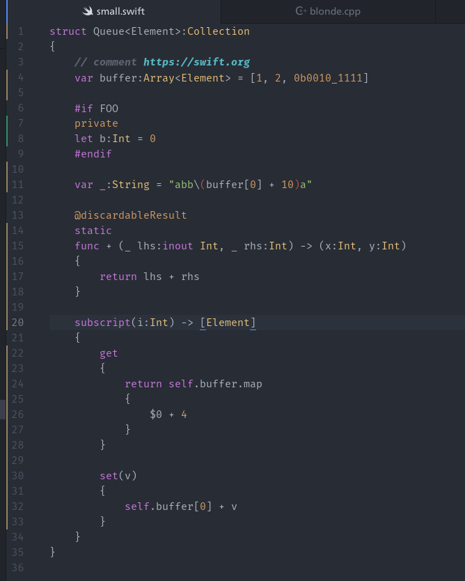

`atomic-blonde` is a SourceKit-based syntax highlighter for the Swift language. Unlike other highlighters, which are based on regular expression grammars, `atomic-blonde` calls into the Swift support libraries to provide perfect, accurate syntax highlighting. The highlights you see in Atom are the same ones your Swift compiler sees.

## A note on installing 

`atomic-blonde` assumes your Swift support libraries are installed at `/usr` (that is, the support libraries live in `/usr/lib` and `/usr/lib/swift/linux`). If you installed swift somewhere else (like in your home directory), you will have to modify the paths in `binding.gyp` to point to your Swift installation, and rebuild the plugin with `apm install`.

For example, if you installed Swift at `/home/taylorswift/tools/swift/`, then the `libraries` field in `binding.gyp` should read 

```
'libraries': [
    '-Wl,-rpath,/home/taylorswift/tools/swift/usr/lib,-rpath,/home/taylorswift/tools/swift/usr/lib/swift/linux', 
    '-L/home/taylorswift/tools/swift/usr/lib', 
    '-L/home/taylorswift/tools/swift/usr/lib/swift/linux', 
    '-lsourcekitdInProc'
]
```

Don’t forget to `apm install` the plugin.


